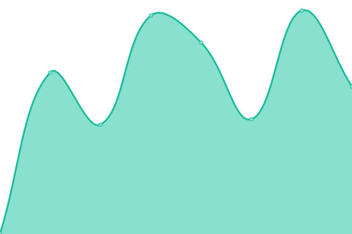

# [📈 Live Status](https://uab-dtic.github.io/sbd-uab-monitoring): <!--live status--> **🟧 Partial outage**

This repository contains the open-source uptime monitor and status page for [UAB-DTIC](https://uab-dtic.github.io/sbd-uab-monitoring), powered by [Upptime](https://github.com/upptime/upptime).

With [Upptime](https://upptime.js.org), you can get your own unlimited and free uptime monitor and status page, powered entirely by a GitHub repository. We use [Issues](https://github.com/uab-dtic/sbd-uab-monitoring/issues) as incident reports, [Actions](https://github.com/uab-dtic/sbd-uab-monitoring/actions) as uptime monitors, and [Pages](https://uab-dtic.github.io/sbd-uab-monitoring) for the status page.

<!--start: status pages-->
<!-- This summary is generated by Upptime (https://github.com/upptime/upptime) -->
<!-- Do not edit this manually, your changes will be overwritten -->
<!-- prettier-ignore -->
| URL | Status | History | Response Time | Uptime |
| --- | ------ | ------- | ------------- | ------ |
|  [25anyscampussabadell](https://25anyscampussabadell.uab.cat) | 🟩 Up | [25anyscampussabadell.yml](https://github.com/uab-dtic/sbd-uab-monitoring/commits/HEAD/history/25anyscampussabadell.yml) | 

 5739ms
     
 | 

<a href="https://uab-dtic.github.io/sbd-uab-monitoring/history/25anyscampussabadell">100.00%</a>
    

|  [guacamole aules](https://aules.sbd.uab.cat) | 🟩 Up | [guacamole-aules.yml](https://github.com/uab-dtic/sbd-uab-monitoring/commits/HEAD/history/guacamole-aules.yml) | 

 975ms
     
 | 

<a href="https://uab-dtic.github.io/sbd-uab-monitoring/history/guacamole-aules">100.00%</a>
    

|  [chispa www](https://www.sbd.uab.cat) | 🟩 Up | [chispa-www.yml](https://github.com/uab-dtic/sbd-uab-monitoring/commits/HEAD/history/chispa-www.yml) | 

 2240ms
     
 | 

<a href="https://uab-dtic.github.io/sbd-uab-monitoring/history/chispa-www">100.00%</a>
    

|  [docusid](https://docusid.sbd.uab.cat) | 🟩 Up | [docusid.yml](https://github.com/uab-dtic/sbd-uab-monitoring/commits/HEAD/history/docusid.yml) | 

 2883ms
     
 | 

<a href="https://uab-dtic.github.io/sbd-uab-monitoring/history/docusid">100.00%</a>
    

|  [gitlab](https://gitlab.sbd.uab.cat) | 🟥 Down | [gitlab.yml](https://github.com/uab-dtic/sbd-uab-monitoring/commits/HEAD/history/gitlab.yml) | 

 3112ms
     
 | 

<a href="https://uab-dtic.github.io/sbd-uab-monitoring/history/gitlab">14.43%</a>
    

|  [glpi](https://glpi.sbd.uab.cat/index.php?noAUTO=1) | 🟩 Up | [glpi.yml](https://github.com/uab-dtic/sbd-uab-monitoring/commits/HEAD/history/glpi.yml) | 

 1464ms
     
 | 

<a href="https://uab-dtic.github.io/sbd-uab-monitoring/history/glpi">100.00%</a>
    

<!--end: status pages-->

[**Visit our status website →**](https://uab-dtic.github.io/sbd-uab-monitoring)

## 📄 License

- Powered by: [Upptime](https://github.com/upptime/upptime)
- Code: [MIT](./LICENSE) © [UAB-DTIC](https://uab-dtic.github.io/sbd-uab-monitoring)
- Data in the `./history` directory: [Open Database License](https://opendatacommons.org/licenses/odbl/1-0/)
